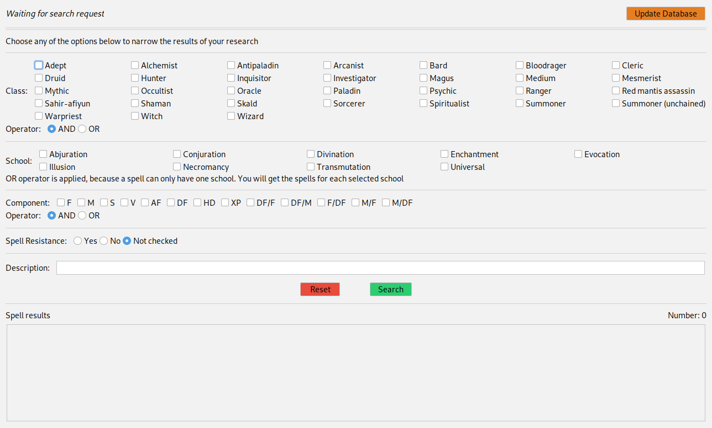

# Spell Searcher
This is a school project from [UQAC](https://www.uqac.ca/) in the course [8INF803](https://cours.uqac.ca/8INF803).

In this project we are creating a web crawler to retrieve [Pathfinder](https://aonprd.com/Spells.aspx?Class=All) spell and creature data.
The aim is to save those data in JSON in order to parse them thanks to Apache Spark.
We also provide a GUI in Scala to search through spells more efficiently.
This is a small project to get started with web crawling and distributed computing. Overall, this project thrives to be an introduction to big data.

For more information please refer to the [Instructions](Instructions-Devoir2-Exercice1.pdf) (in French).

## Interface
Two interfaces are available for this project. The main one is the Desktop interface in [Scala Swing](https://github.com/scala/scala-swing), using [Apache Spark™](https://spark.apache.org/) as a backend to process request.

The orange "Update Database" button launches the python crawler in order to retrieve spells and creatures information from [Archives of Nethys](https://www.aonprd.com/).
The first launch will take longer than the others as the crawler will automatically load the database from the website and generate the JSON files needed for [Apache Spark™](https://spark.apache.org/) processing.

You will need the [Scrapy](https://scrapy.org/) package installed on your machine for the crawler to work.
You can expect the crawler to retrieve all information in between 2 and 10 minutes, depending on your internet speed.
Following updates will be faster because HTTP requests are cached locally.



The second interface is a Web interface written in PHP and using a MySQL database as a backend.
This interface is a more straight-forward approach available [here](https://azura-levidre.000webhostapp.com/spellsv2).

## Installation
### Scrapy
To install the latest version of Scrapy:
```
$ pip install scrapy
```
You can also refer to the documentation: [Scrapy Installation](https://docs.scrapy.org/en/latest/intro/install.html).

### Apache Spark
To install and configure Apache Spark on Linux please refer to [spark-setup.sh](spark-setup.sh).
You can also refer to the documentation: [Apache Spark Installation](https://spark.apache.org/docs/latest/).

## Built With
* [Scala 2.12.12](https://www.scala-lang.org/) - Scala is a general-purpose programming language providing support for both object-oriented programming and functional programming.
* [Oracle OpenJDK 11.0.9](https://openjdk.java.net/) - OpenJDK (Open Java Development Kit) is a free and open-source implementation of the Java Platform Standard Edition (Java SE).
* [sbt 1.4.5](https://www.scala-sbt.org/) - sbt is a build tool for Scala, Java, and more. It requires Java 1.8 or later.
* [Apache Spark™ 3.0.1](https://spark.apache.org/) - Apache Spark is an open-source distributed general-purpose cluster-computing framework.
* [scala-swing 3.0.0](https://github.com/scala/scala-swing) - scala-wing is a UI library that wraps most of Java Swing for Scala in a straightforward manner. The widget class hierarchy loosely resembles that of Java Swing.
* [FlatLaf 0.45](https://github.com/JFormDesigner/FlatLaf) - FlatLaf is a modern open-source cross-platform Look and Feel for Java Swing desktop applications.
* [Python 3.9.1](https://www.python.org/) - Python is an interpreted, high-level and general-purpose programming language.
* [Scrapy 2.4.1](https://scrapy.org/) - Scrapy is a free and open-source web-crawling framework written in Python.

## Authors
* [maximenrb](https://github.com/maximenrb)
* [adrienls](https://github.com/adrienls)
* [LisaMoulis](https://github.com/LisaMoulis)

## License
This project is licensed under the GNU AGPLv3 License - see the [LICENSE.md](LICENSE) file for details

License chosen thanks to [choosealicense.com](https://choosealicense.com/)